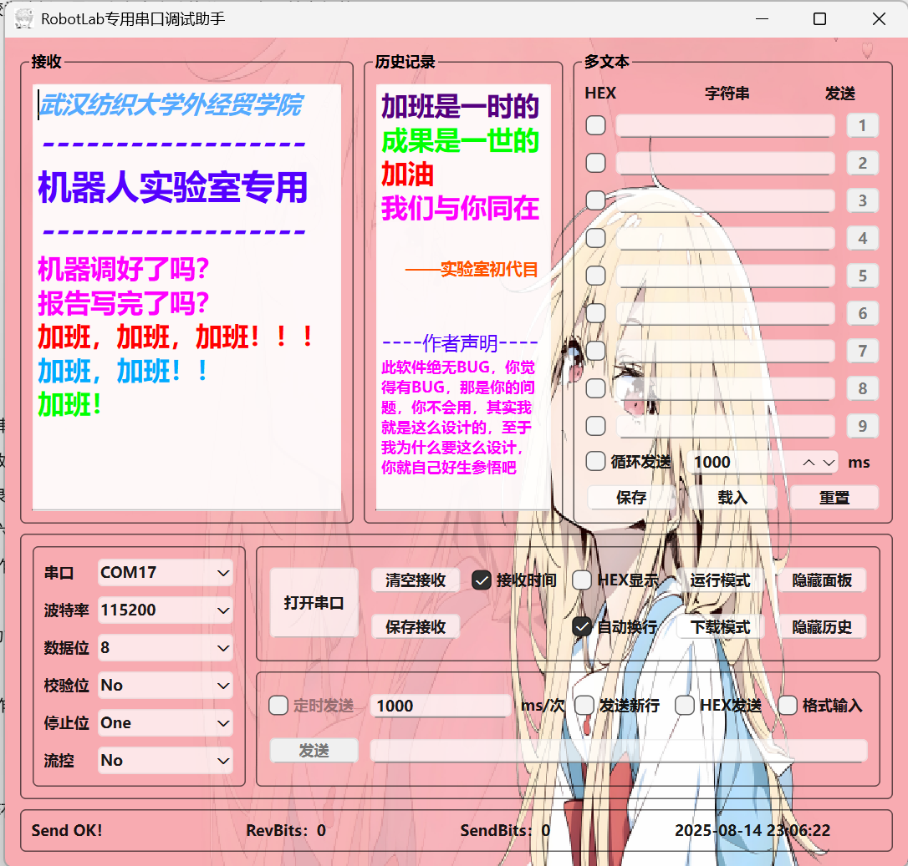

# Special-Serial-Port-Debugger

基于QT开发的串口调试助手

# 

# 《RobotLab 专用串口调试助手》软件介绍

## 一、软件基本信息

1. **软件名称**
* RobotLab 专用串口调试助手
1. **界面风格**
* 界面采用粉色为主色调，整体风格较为清新。界面上有多个功能分区，布局较为规整。

## 二、功能模块

1. **接收模块**
* **端口设置**
  
  * 可以设置端口，如 COM17。
  
  * 波特率可设置为 115200。
  
  * 数据位为 8。
  
  * 校验位为 No。
  
  * 停止位为 One。

* **操作按钮**
  
  * 有 “打开串口” 按钮，用于开启串口连接。
  
  * “清空接收” 按钮，用于清除接收的内容。
  
  * “接收时间” 选项，可能用于记录接收数据的时间。
  
  * “HEX 显示” 选项，可选择以十六进制显示接收的数据。
  
  * “运行模式” 和 “隐藏面板” 等操作选项。
1. **历史记录模块**
* 提供对操作历史记录的查看和管理功能，方便用户追溯之前的操作。
1. **多文本模块**
* 包括 “HEX 字符串” 等文本输入和操作区域，便于进行数据的输入和转换操作。
1. **发送模块**
* **发送设置**
  
  * 有 “循环发送” 功能，可设置循环发送的次数（如 1000 次）。
  
  * 发送间隔时间（ms）可设置。
  
  * “保存”“载入”“重置” 按钮，用于对发送数据的管理。

* **发送操作**
  
  * “Send OK!” 按钮用于执行发送操作。
  
  * 记录了 “RevBits” 和 “SendBits” 的数据量，以及操作时间（2025 - 08 - 14 22:44:54）。

## 三、软件特色

1. **特定实验室用途**
* 软件标注为 “武汉纺织大学外经贸学院机器人实验室专用”，表明该软件是为特定实验室环境设计和开发的，针对性强。
1. **界面友好**
* 界面设计简洁明了，功能分区清晰，操作按钮和选项易于识别和操作，适合技术人员使用。
1. **功能全面**
* 涵盖了串口调试的基本功能，包括端口设置、数据接收、发送以及历史记录查看等，满足实验室串口调试的需求。

## 四、使用场景

1. **机器人实验室调试**
* 适用于武汉纺织大学外经贸学院机器人实验室的设备调试工作，能够帮助技术人员进行串口数据的收发和设备的调试操作。
1. **教学与科研**
* 在相关专业的教学和科研过程中，可作为学生和研究人员进行串口通信实验和项目开发的工具，辅助教学和科研工作的开展。
